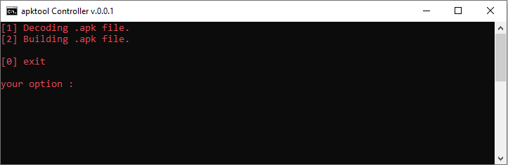

# apktool_Controller
Building and dismantling Android applications depends on Apktool (windows version).


<div align="center">
    <!--a href="" target="_blank"-->
        
    <!--/a-->
</div>
<!---->


### Languages :
* bach

### System :
* windows

# Requirements
[✓] powershell
[✓] Java 8 (JRE 1.8)
[✓] Basic knowledge of Android SDK, AAPT and smali

# How to run after download
```
start start.bat
```


# SUPPORTED DISTRIBUTIONS
|Distribution | Version Check | supported | status |
----------|-------|------|-------|
|windows|10 | yes | working   |


## Release History
```
[◉] Version 0.0.1 [07-05-2020]
...
```


### Contact :
##### Mail : by.root96@gmail.com

## License
Copyright (C) 2010 - 2020 [byRo0t96](https://byro0t96.github.io/)

